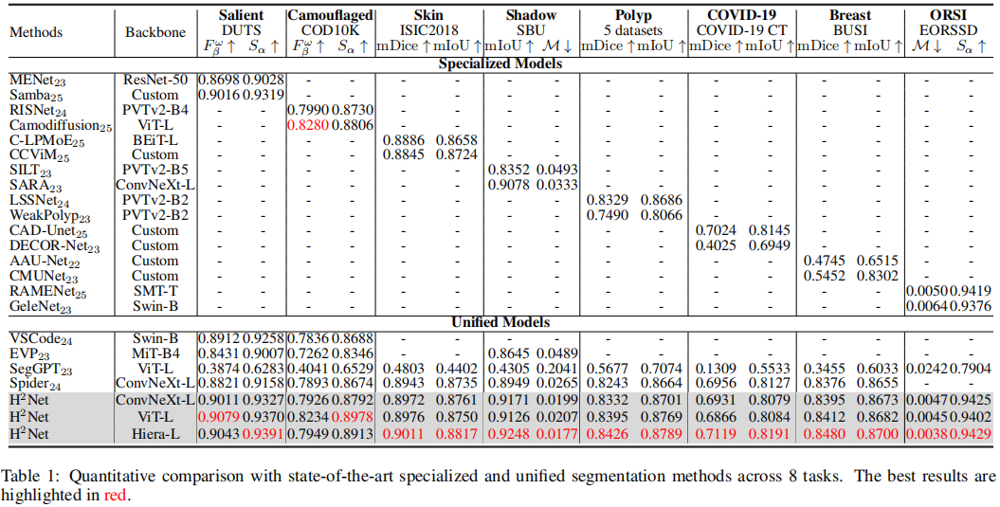

# H^2Net: Homo- and Heterogeneous Networks for Unified Segmentation

> [**H$^2$Net: Homo- and Heterogeneous Networks for Unified Segmentation**]()
>
> **IJCAI 2026**
>
> **Unified segmentation**

**Abstract**

Unified segmentation aims to consolidate multiple vision tasks into a single model, yet faces two core challenges: learning robust homogeneous features (\emph{e.g.}, shared low- and mid-level cues) to enable cross-domain knowledge transfer, while disentangling heterogeneous features (\emph{e.g.}, task-specific semantic objectives) to avoid negative transfer and preserve task independence. To address these challenges, we propose the \underline{H}omo- and \underline{H}eterogeneous \underline{Net}work (H
Net), a unified framework that jointly models shared homogeneous representations and task-specific heterogeneous features. Specifically, H
Net incorporates a Cross-Modal Structure Enhancement Module (CSEM), which integrates auxiliary depth priors via joint frequency–spatial cross-modal attention to strengthen task-agnostic structural representations. In addition, a Task Adapter Pool (TAP) is introduced to model task-specific heterogeneous features by assigning dedicated adapters to individual tasks, enabling task-aware feature modulation and semantic disentanglement within a shared backbone. Extensive experiments on benchmarks spanning eight tasks demonstrate the effectiveness of the proposed approach and its superior performance. Code and results will be available at \url{https://h2net-ijcai26.github.io}.
<p align="center">
  
</p>
<p align="center">
  
</p>

### Prediction results
All prediction results can be found in [Baidu Netdisk](https://pan.baidu.com/s/1qJESkthTq84gESfdUf9XvA?pwd=1234), code: 1234.

### Training
The training stage for H$^2$Net:
```
CUDA_VISIBLE_DEVICES=0,1,2,3 torchrun --nproc_per_node=4 train.py
```

**The training code of `CORAL` will be released  after the paper is published.**
### Evaluation
All checkpoints can be found in [Baidu Netdisk](https://pan.baidu.com/s/1ESZeXPoHYtuCJKp3j39kOw?pwd=1234), code: 1234.
```
python test.py
```
Performance of H$^2$Net



## Acknowledgements

Our method builds upon a series of foundation models, including [SAM](https://github.com/facebookresearch/segment-anything). Thanks for their excellent contributions.

## Citing

If you find our work interesting, please consider using the following BibTeX entry:

```latex
@InProceedings{,
    author    = {},
    title     = {},
    booktitle = {},
    month     = {June},
    year      = {2026},
    pages     = {}
}
```
